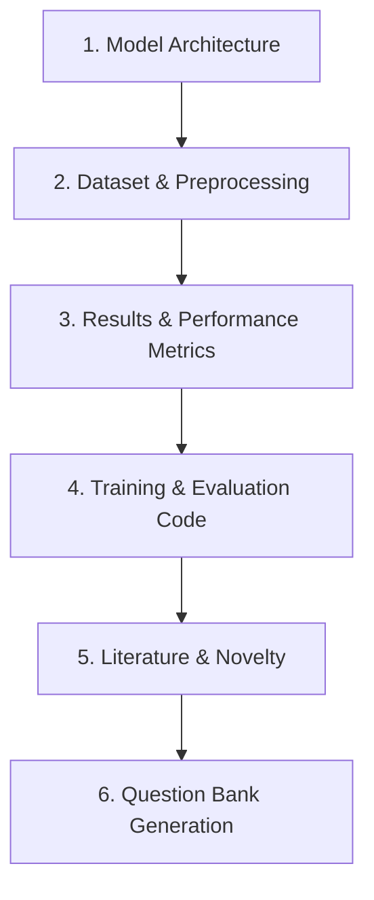

# DCSAUNet Study For Interviews

> **Repository Purpose:** Dedicated learning plan to master the research project ahead of the panel presentation, ensuring a strong grasp of both foundational and advanced concepts.

---

## 📌 Progress & Status

### 📅 Date: 27-07-2026

* **Current Status:** The paper is on the verge of completion by Krishna ji's grace.
* **Strategy Adjustments:** Started with *Neural Networks and Deep Learning* by Charu, completed Chapters 1 and 2. Due to the book's vast scope, it will now be used selectively to build a theoretical base, while primary focus shifts directly to DCSAU-Net and its core architecture.

### 🗺️ Planned Deep-Dive Structure

1. **Architecture:** Master the network structure and connect it back to baseline deep learning concepts.
2. **Dataset & Preprocessing:** Study the dataset (referencing SAUNet) and its image preprocessing steps.
3. **Results & Metrics:** Analyze paper results and prepare detailed explanations for key performance metrics.
4. **Training & Evaluation:** Review code execution details (e.g., rationale behind Test-Time Augmentation / TTA).
5. **Literature & Novelty:** Review key references (e.g., ESE, DCSAUNet-Medium) and articulate our paper's exact novelty.
6. **Question Bank:** Generate ~100 relevant questions across these topics for interview practice.

> **Note:** This learning plan is subject to updates as needed. Upon completion, consult the AI agent to review and identify any remaining gaps.

---

## 📋 Checklist

- [ ] **In-Class Prep:** Recap ML class notes.
- [ ] **Prompt AI Agent:**
  - [ ] **Step 1:** Share study plan requirements & attach model architecture.
  - [ ] **Step 2:** Cover foundational concepts from Chapters 4, 5, and 9 (Charu book).
  - [ ] **Step 3:** Generate 100+ interview-ready questions.
- [ ] **Targeted Reading:** Complete assigned chapters from *NN and DL* by Charu.
- [ ] **Architecture Connections:** Map foundational deep learning concepts directly to the DCSAU-Net pipeline.
- [ ] **Interview & Speaking Practice:** Practice top questions on the model, general DL concepts, and draft clear answers for fluent speaking.
- [ ] **Study Plan Completion:** Finalize the study plan and ask for active feedback.
- [ ] **Gap Analysis:** Address and cover all remaining knowledge gaps.

_Let's do this Jai Shree Krishna_
